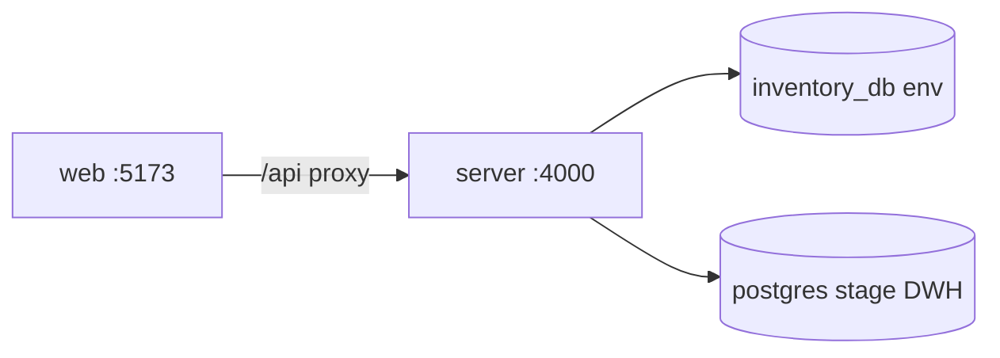

# Servis Kataloğu & DWH Lineage

Java servis envanterinde **“bu servis değişirse kime dokunur?”** sorusuna cevap veren web uygulaması: modül ağacı, etki haritası, metod call-graph, süreç akış haritaları, DWH lineage.

| Bileşen | Klasör | Port (dev) |
|---------|--------|------------|
| Arayüz | `web/` | http://127.0.0.1:5173 |
| API | `server/` | http://127.0.0.1:4000 |

---

## İlk kez kendi cihazında çalıştırma

### Gereksinimler

- **Node.js 22+** (`node -v`)
- **npm** (Node ile gelir)
- **PostgreSQL** — yalnızca `CATALOG_SOURCE=inventory` veya DWH sekmesi için gerekli; mock modda zorunlu değil

### 1. Repoyu al ve bağımlılıkları kur

```bash
git clone https://github.com/kaanerdem1/service-dependency.git
cd service-dependency
npm run bootstrap
```

`bootstrap` kök, `server/` ve `web/` için `npm install` çalıştırır.

### 2. Ortam dosyası

```bash
cp server/.env.example server/.env
```

`server/.env` dosyasını düzenle. İki tip kurulum:

#### A) Hızlı deneme — mock katalog (Postgres yok)

Postgres kurmadan UI ve API’yi görmek için:

```env
CATALOG_SOURCE=mock
```

Sonra:

```bash
npm run dev
```

Tarayıcı: http://127.0.0.1:5173 — sınırlı demo veri; gerçek ~37k servis listesi **yok**.

#### B) Tam veri — inventory_db (önerilen ekip kullanımı)

1. PostgreSQL’de `inventory_db` ve `env` şeması yüklü olmalı (dump restore veya kurum içi yedek).
2. `server/.env` örneği:

```env
CATALOG_SOURCE=inventory

INVENTORY_PGHOST=127.0.0.1
INVENTORY_PGPORT=5432
INVENTORY_PGDATABASE=inventory_db
INVENTORY_PGUSER=postgres
INVENTORY_PGPASSWORD=your_password
INVENTORY_PGSCHEMA=env
```

DWH sekmesi için ayrıca `PGHOST`, `PGDATABASE`, `PGSCHEMA=stage` vb. (bkz. `server/.env.example`).

3. API + UI:

```bash
npm run dev
```

4. Kontrol:

```bash
curl -s http://127.0.0.1:4000/api/health | jq
```

`inventory.ok: true` görmelisin. Süreç haritaları boşsa PAR ingest: [docs/db.md §13](docs/db.md#13-process-xml--db-eski-hale-döndü--tabloya-yazılmıyor).

### 3. Günlük geliştirme

```bash
npm run dev
```

Tek komut API ve UI’yi birlikte açar (`concurrently`).

**İki terminal** tercih edersen:

```bash
npm run dev --prefix server
npm run dev --prefix web
```

### Sık sorunlar

| Belirti | Ne yap |
|---------|--------|
| UI’da “API hatası” banner | `npm run dev` ile API’nin 4000’de ayakta olduğunu kontrol et |
| Ağaç boş / 500 | `CATALOG_SOURCE=inventory` ise PG bilgileri ve dump |
| Port 5173 dolu | Vite otomatik 5174’e geçer; terminal çıktısındaki URL’yi aç |
| Süreç listesi `.par` isimli | `npm run ingest:process-par` — [db.md §13](docs/db.md#13-process-xml--db-eski-hale-döndü--tabloya-yazılmıyor) |
| DB yedek (yerel) | `npm run backup:inventory-db --prefix server` → `backups/postgres/` (git’te yok) |

---

## Teknoloji yığını

| Katman | Seçimler |
|--------|-----------|
| UI | React 19, TypeScript, Vite 8 |
| Graf & motion | React Flow 11, Motion |
| Arama / liste | cmdk (⌘K), TanStack Virtual |
| PDF | jsPDF, html-to-image |
| API | Node 22+, Express 5, tsx |
| Veri | `pg` — inventory (`env.*`) ve DWH (`stage.*`) |

---

## Mimari (kısa)



- **Servis etkisi:** `call_edge` rollup + BFS → hop-1 onay listesi, 2–4 hop harita keşfi.
- **Issue/onay workflow** bu repoda değil; entegrasyon: [docs/entegrasyon.md](docs/entegrasyon.md).

---

## Kod rehberi

| Konu | Dosya |
|------|--------|
| UI kabuk | `web/src/App.tsx` |
| Servis haritası | `web/src/components/ImpactMap.tsx` |
| Süreç akış / rota | `web/src/components/ProcessFlowMap.tsx`, `processRouteStore.ts` |
| API | `server/src/index.ts` |
| Etki grafi | `server/src/impactGraph.ts` |
| DWH UI | `web/src/dwh/DwhPage.tsx` |

---

## Diğer dokümanlar (`docs/`)

| Dosya | Ne için |
|--------|---------|
| [docs/PRODUCT.md](docs/PRODUCT.md) | Ürün kapsamı, özellik durumu |
| [docs/db.md](docs/db.md) | Tablolar, API↔DB, ingest, kalıcılık özeti (§14) |
| [docs/catalog-persistence.md](docs/catalog-persistence.md) | Kalıcılık tabloları, API↔DDL, migration |
| [docs/process-flow.md](docs/process-flow.md) | Tam akış vs kullanıcı rotası |
| [docs/entegrasyon.md](docs/entegrasyon.md) | Issue tool embed / deep link |

---

## Tema / geri dönüş

Marka rengi Issue Management ile hizalanır: sidebar zemin `#353943`, yükseltilmiş alan `#404452`, metin `#b5bbcd`, hover `#9ebbdd`, buton `#0079f8`. Önceki yeşil palet:

```bash
git checkout safe/green-theme-pre-im
```

---

## README dosyaları

Yalnızca **bu dosya** (`README.md`, repo kökü) güncel kurulum ve giriş rehberidir.

- `docs/README.md` ve `web/README.md` — GitHub / IDE’nin alt klasörlerde README araması için kısa yönlendirme; içerik burada birleştirildi.
