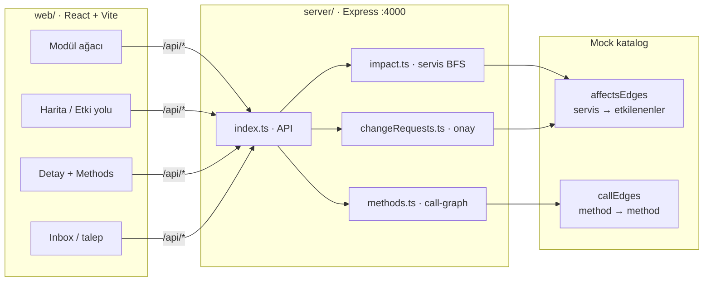
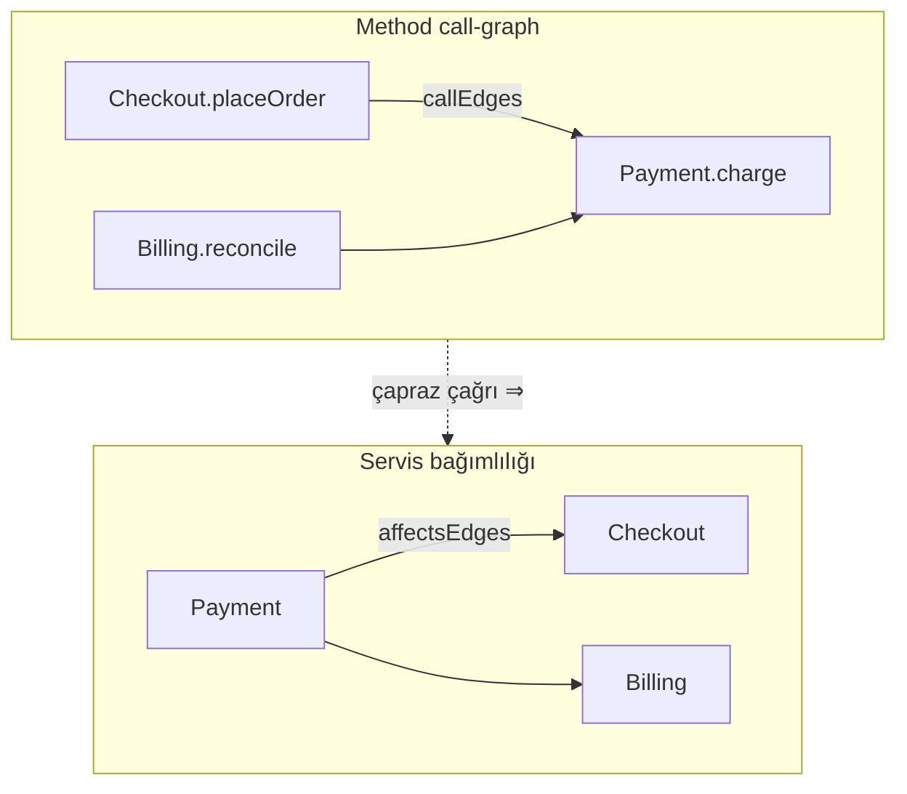
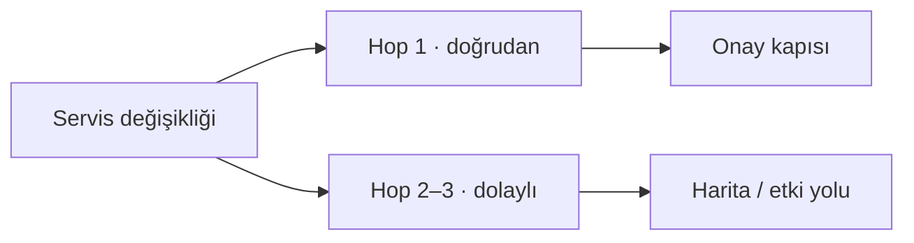

# Service Dependency

Statik katalog + etki analizi + değişiklik onay ürünü.

Ürün özü: bir servis veya metod değişince **kime / hangi metoda** ucu dokunduğu görülsün; onay yalnız **doğrudan etkilenenler** üzerinden açılsın.

## Mimari (özet)



Vite dev’de UI `/api/*` → `http://127.0.0.1:4000` (proxy).

### İki katmanlı bağımlılık



| Katman | Veri | Ne işe yarar |
|--------|------|----------------|
| **Servis** | `affectsEdges` | Harita, etki yolu, **onay listesi (hop 1)** |
| **Method** | `callEdges` | Method haritası, callers/callees, blast özeti |

Kural: çapraz servis method çağrısı varsa, callee servisin `affectsEdges` listesinde caller servis de olmalı.

### Onay vs keşif



- **Onay** → yalnız hop 1 (downstream / beni çağıranlar)
- **Harita** → hop 2–3 ile dolaylı zinciri keşfet (pivot / geri-ileri)

### Kodda nereye bakmalı?

| Konu | Dosya |
|------|--------|
| API rotaları | `server/src/index.ts` |
| Servis bağımlılığı (`affectsEdges`) | `server/src/data.ts` |
| Method + call-graph | `server/src/methods.ts` |
| Servis etki BFS | `server/src/impact.ts` |
| Talep / onay / inbox | `server/src/changeRequests.ts` |
| UI kabuk | `web/src/App.tsx` |
| Servis haritası | `web/src/components/ImpactMap.tsx` |
| Method haritası | `web/src/components/MethodImpactMap.tsx` |
| Domain tipleri | `web/src/types.ts` |

Mock’u yeniden üretmek: `python3 scripts/gen_mock_catalog.py`  
Tutarlılık (opsiyonel): `curl -s http://127.0.0.1:4000/api/meta/call-graph-consistency`

## Çalıştırma

Tek terminal (önerilen):

```bash
npm run bootstrap   # ilk sefer
npm run devall
```

`devall`, API ve UI’yi birlikte başlatır. Kısa alias: `npm run dev`.

İki terminal (alternatif):

```bash
# API
cd server
npm install
npm run dev
```

```bash
# UI
cd web
npm install
npm run dev
```

UI: http://127.0.0.1:5173 · API: http://127.0.0.1:4000/api/health

Dokümanlar: `docs/ServiceDependency.md`, `docs/UI_UX_GEREKSINIMLER.md`, `docs/ONAY_ZINCIRI_SENARYOLAR.md`, `docs/SNAPSHOT.md`
