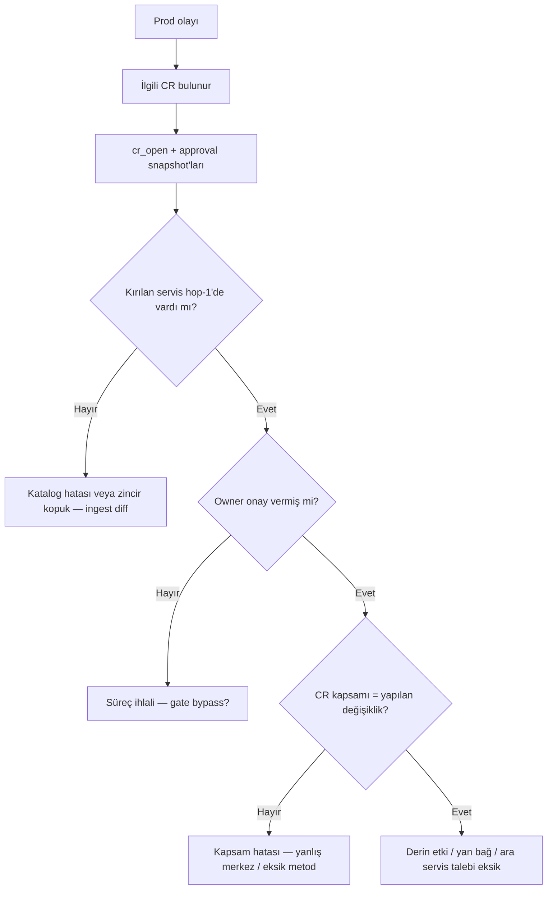

# Snapshot — karar anının dondurulmuş kanıt paketi

> Backlog: `docs/changes.md` · İlgili: `[README.md](./README.md)`, `[ONAY_ZINCIRI_SENARYOLAR.md](./ONAY_ZINCIRI_SENARYOLAR.md)`, `[UI_UX_GEREKSINIMLER.md](./UI_UX_GEREKSINIMLER.md)`  
> Tarih: 2026-08-19

---

## 0. Özet

Snapshot **ekran görüntüsü değil**; bir değişiklik veya onay anında *“sistem ve insan ne biliyordu, neyi gördü?”* sorusuna cevap veren **delil paketi**.

Ürün statik katalog + etki analizi + onay zinciri olduğu için snapshot:

- APM / runtime log taşımaz.
- Onay anındaki **etki kümesini** (hop 1, isteğe bağlı hop 2+, yan bağlar) dondurur.
- Harita **görünüm durumunu** ve kullanıcının **gezinme yolunu** kaydeder.
- Post-mortem ve yönetici denetiminde *kapsam hatası mı, süreç hatası mı, katalog hatası mı* ayrımını mümkün kılar.

**Tek cümle (yönetici):** *Bu deploy onaylanırken sistem ve owner neyi görmüştü?*

---


## 1. Ne işe yarar?


### Servise bakan yazılımcı


| Durum         | Snapshot neyi kanıtlar                                                             |
| ------------- | ---------------------------------------------------------------------------------- |
| Talep açarken | Merkez servis/metod, açık katman sayısı, yan bağ açık mı                           |
| Onay verirken | “Ben hangi hop-1 kümesine onay verdim?” — revize sonrası liste değişse bile        |
| Hata sonrası  | “FinanceBatch’i görmedim” iddiası — haritada tıklanmış mı, hop-1 listesinde var mı |


### Yönetici / lider


| Soru                     | Snapshot cevabı                                                                  |
| ------------------------ | -------------------------------------------------------------------------------- |
| Süreç ihlali var mı?     | Gate açılmadan deploy; hop-1 dışı etki bilinçli mi göz ardı                      |
| Kapsam doğru mu?         | CR metni (“Billing API”) vs merkez düğüm uyumu                                   |
| Zincir kopuk mu?         | Dolaylı etki hop-2’de görünüyordu; ara servis için ayrı talep açılmadı (Model A) |
| Katalog güvenilir miydi? | `catalogRevision` + olay sonrası canlı diff                                      |


### Onay ürünü (Model A)

Hop yalnız 1 onay listesine girer; snapshot **talep açılışı** ve **owner onayı** anlarında hop-1 kümesini kilitler. Keşif için açılan 2+ katman ayrı alanda saklanır — onay kümesi ile karışmaz.

---


## 2. Snapshot türleri


| Tür         | Tetikleyici                       | Amaç                             |
| ----------- | --------------------------------- | -------------------------------- |
| `explore`   | Kullanıcı “Anlık görünümü kaydet” | Taslak / keşif; CR yok           |
| `cr_open`   | Değişiklik talebi açılışı         | Hop-1 etki kümesi kilitlenir     |
| `approval`  | Owner flag atınca                 | “Bu küme ile onay verdim”        |
| `gate_open` | Tüm 🟢 → gate açık                | Deploy öncesi son durum          |
| `incident`  | Prod olayı CR’a linklenince       | Olay anında canlı katalog diff’i |


MVP: `explore`, `cr_open`, `approval`. Sonra `gate_open`, `incident`.

---


## 3. Veri modeli

```typescript
type SnapshotType =
  | 'explore'
  | 'cr_open'
  | 'approval'
  | 'gate_open'
  | 'incident'

type Snapshot = {
  id: string
  type: SnapshotType
  createdAt: string // ISO-8601
  actor: { userId: string; displayName?: string }

  changeRequestId?: string
  catalogRevision: string // ingest batch / git commit / hash

  focus: {
    level: 'service' | 'method'
    id: string
    label: string
    treePath: string[] // proje → paket → servis → metod
  }

  /** Modül ağacı + harita + sekme + chrome (sıralı, atlama yok) */
  navigationTrail: Array<{
    at: string
    action:
      | 'tree_select'
      | 'map_select'
      | 'search_select'
      | 'tab_change'           // Harita ↔ İlişkiler
      | 'nav_back'
      | 'nav_forward'
      | 'drawer_toggle'        // Etki özeti aç/kapa
      | 'sidebar_toggle'       // Modül paneli aç/kapa
      | 'layer_change'         // katman ileri/geri/tümü
      | 'cascade_toggle'
      | 'layout_toggle'        // LTR ↔ radial
      | 'method_popover_open'
    target?: { level: 'service' | 'method'; id: string; label: string }
    /** action sonrası UI durumu — her adımda snapshot */
    uiAfter: UiChromeState
  }>

  /** Son kayıt anındaki chrome (trail’in son hali ile aynı şema) */
  uiChrome: UiChromeState

  viewState: {
    layout: 'ltr' | 'radial'
    visibleMaxHop: number
    maxHopAvailable: number
    showCascadeEdges: boolean
    /** İsteğe bağlı: zoom, pan, seçili kenar */
    viewport?: { x: number; y: number; zoom: number }
    focusEdgeId?: string
  }

  /** Donmuş etki — yeniden hesaplanmış JSON; PNG’den güvenilir */
  impact: {
    hop1: ImpactRow[]
    deeper?: ImpactRow[] // visibleMaxHop kadar
    cascadeEdges?: CascadeEdge[]
  }

  /** approval / gate_open türlerinde */
  approvals?: Array<{
    ownerId: string
    serviceId: string
    flag: 'green' | 'red' | 'yellow' | 'unseen'
    note?: string
    at: string
  }>

  /** CR açıklaması snapshot anında */
  changeSummary?: { title?: string; reason?: string }

  /** İnsan okuması için — yapısal verinin eki; tek başına kanıt değil */
  imageUrl?: string // birincil harita PNG (P0: cr_open / approval)
  screenshots?: Array<{
    surface: 'map' | 'affected' | 'drawer' | 'full_app'
    capturedAt: string
    url: string
    sha256?: string
  }>

  /** Evidence pack bütünlüğü (CMMC / SOC2 tarzı) */
  manifest?: {
    files: Array<{ name: string; sha256: string; role: 'json' | 'png' | 'other' }>
    packSha256: string
  }

  /** incident türünde */
  liveCatalogDiff?: {
    comparedAt: string
    hop1Added: string[]
    hop1Removed: string[]
    revisionThen: string
    revisionNow: string
  }
}

type ImpactRow = {
  id: string
  label: string
  hop: number
  direction: 'caller' | 'callee' // UI: çağıran / çağırdığı
  edgeKind: 'tree' | 'cascade'
  ownerId?: string
}

type CascadeEdge = {
  fromId: string
  toId: string
  fromLabel: string
  toLabel: string
}

/** Her trail adımında ve snapshot sonunda kaydedilir */
type UiChromeState = {
  activeTab: 'map' | 'affected'
  drawerOpen: boolean          // Etki özeti
  sidebarOpen: boolean         // Modül paneli
  searchOpen?: boolean
  selectedMethodId?: string | null
}
```


### Saklama ilkeleri

- **Yapısal veri** (`impact`, `viewState`, `navigationTrail`, `uiChrome`) birincil kaynak; görsel türetilir veya eklenti olarak saklanır.
- **Trail kuralı:** Her anlamlı etkileşimde `uiAfter` yazılır; “hangi sekmedeydi, drawer açık mıydı?” sorusu trail’den veya son `uiChrome`’dan okunur.
- Görsel üzerinde **watermark:** snapshot id + `createdAt` + isteğe bağlı `changeRequestId`.
- **Evidence pack:** JSON + PNG’ler `manifest` ile hash’lenir (silme/değiştirme tespiti; CMMC 3.4.5 / SOC2 CC8.1 pratiği).
- PII / credential / runtime trace **yok**.
- Kaynak kod diff’i snapshot içinde değil; PR linki CR’da kalır.

---


## 4. UI / UX


### Tetikleyiciler


| Yüzey              | Eylem                                            |
| ------------------ | ------------------------------------------------ |
| Harita dock        | “Kaydet” (explore)                               |
| CR oluştur         | Otomatik `cr_open`                               |
| Owner inbox → flag | Otomatik `approval`                              |
| Talep detayı       | Snapshot listesi + önizleme + indir (JSON / PNG) |
| Gate açılışı       | Otomatik `gate_open` (P1)                        |


### Talep detayında gösterim

```
[ Snapshot · cr_open · 19 Ağu 16:42 ]
  Merkez: BillingService · Katman 2/4 · Yan bağ kapalı
  Hop-1: ReportingService, FinanceBatchJob (2)
  [ Haritayı aç ] [ PNG indir ] [ JSON indir ]

[ Snapshot · approval · Zeynep · 19 Ağu 17:10 ]
  Flag: 🟢 · Not: "API sözleşmesi uyumlu"
```


### Yeniden oynatma (P1)

Kayıtlı `viewState` + `impact` ile haritayı read-only modda aç; canlı katalog yerine snapshot grafik subset’i. “Canlı ile karşılaştır” toggle.

---


## 5. Post-mortem akışı




**Yazılımcı hatası** çoğu zaman şunlardan biri:

1. Yanlış servis/metodu merkez aldı (focus ≠ gerçek değişiklik).
2. Hop-1 listesini okumadan onay verdi (approval snapshot’ta trail kısa).
3. Dolaylı yolu görmedi (yan bağ kapalı, katman 1’de kaldı).
4. Model A: ara servis değişecekken ayrı talep açmadı.

---


## 6. MVP kapsamı


### P1

- [ ] Çoklu yüzey PNG (`affected`, `drawer`, `full_app` paketi)
- [ ] Read-only yeniden oynatma (trail adım adım oynat)
- [ ] `gate_open`
- [ ] `incident` + canlı katalog diff
- [ ] `manifest` SHA256 evidence pack


### Bilinçli dışarıda (şimdilik)

- Runtime APM, log, metrik
- Kaynak kod diff içeriği
- Metod seviyesi snapshot (servis MVP sonrası aynı model)

---


## 7. API taslağı

```
POST   /api/snapshots              # explore (body: Snapshot minus id)
POST   /api/change-requests/:id/snapshots   # cr_open (sunucu tetikler)
POST   /api/change-requests/:id/approvals   # mevcut flag + snapshot embed
GET    /api/change-requests/:id/snapshots
GET    /api/snapshots/:id
GET    /api/snapshots/:id/image    # P1
POST   /api/snapshots/:id/compare-live      # P1 incident diff
```

Sunucu `impact` kümesini snapshot anında `impact.ts` / `methods.ts` ile **yeniden hesaplar**; istemci sadece `viewState` ve `navigationTrail` gönderir — manipülasyon riski azalır.

---


## 8. Açık kararlar


| #   | Soru                          | Öneri                                                 |
| --- | ----------------------------- | ----------------------------------------------------- |
| 1   | Snapshot silinebilir mi?      | Hayır (audit); yalnız admin arşiv                     |
| 2   | explore CR’a bağlanabilir mi? | Evet — “taslak kanıtı” olarak link                    |
| 3   | Retention                     | MVP: sınırsız mock; prod: politika sonra              |
| 4   | Metod pivot                   | Servis snapshot ile aynı şema; `focus.level = method` |
| 5   | Trail ne kadar detaylı?       | Her anlamlı UI olayı; scroll/zoom hareketi hariç (gürültü) |
| 6   | Screenshot zorunlu mu?        | `cr_open` / `approval`: evet (otomatik); `explore`: isteğe bağlı |


---

## 9. Başarı kriteri

Yönetici şu soruya **5 dakikada**, snapshot olmadan değil snapshot ile cevap alabilmeli:

> *“Bu release’te FinanceBatch neden kırıldı — kim neyi görmeden onayladı veya yanlış kapsamda talep açtı?”*

---

## 10. Sorular — spec ile uyum ve ek öneriler

> Aşağıdaki maddeler ürün sahibi sorularıdır; mevcut spec ile karşılaştırılmıştır.

### S1 — “Kullanıcının gittiği yollar, harita mı ilişkiler mi, etki özeti açık mı… hiçbir detay kaçmasın; gerekli yerde screenshot da olsun.”

Trail, `uiChrome`, sekme/drawer/sidebar/katman/yan bağ/layout olayları kodda kayıtlı.

| Detay | Durum |
|-------|--------|
| Screenshot | ⚠️ `cr_open` / `approval` harita PNG mevcut; tam kanıt için `full_app` paketi P1 |

**Kaçınılacak (gürültü):** scroll, zoom, hover, mouse hareketi — trail’i şişirir, post-mortem değeri düşük. Zoom/pan yalnızca son `viewState.viewport`’ta.

**Screenshot stratejisi (öneri):**

| Tür | Otomatik PNG |
|-----|----------------|
| `explore` | İsteğe bağlı (kullanıcı “Kaydet”) |
| `cr_open` | Harita + watermark (zorunlu) |
| `approval` | Harita + watermark (zorunlu) |
| `gate_open` | `full_app` — harita + İlişkiler + drawer durumu (P1) |

Yapısal JSON birincil kanıt; PNG denetçi / yönetici için hızlı okuma. İkisi birlikte SOC2 / CMMC “evidence pack” mantığına uyuyor.

---

### S2 — Güvenlik / uyum odaklı sistemler snapshot’ı nasıl kullanıyor?

Araştırma özeti (NIST SP 800-171 / CMMC 3.4.3–3.4.5, SOC2 CC8.1, ITIL change management):

| Pratik | Bizde karşılığı |
|--------|-----------------|
| **Bağlantılı zincir:** talep → onay → deploy artifact | CR + snapshot + (ileride PR/commit link) |
| **Kim, ne zaman, ne karar verdi** — ayrı kimlikler | `actor`, `approvals[]`, timestamp |
| **Değişiklikten önce onay** kanıtı | `approval` snapshot zamanı < deploy zamanı |
| **Evidence pack** — PDF/log/screenshot + hash manifest | §3 `manifest`, `screenshots[]` |
| **Immutable / silinemez kayıt** | §8 karar #1 |
| **Separation of duties** | Requester ≠ owner; farklı `actor` |
| **Olay sonrası reconstruction** | `incident` + `liveCatalogDiff` |
| **PAM oturum kaydı** (yüksek güvenlik) | Bizde yok (APM/runtime dışı ürün); yerine **trail + PNG** yeterli MVP |

**Spec’e eklenenler (bu bölümden):**

1. `manifest` + SHA256 — paket bütünlüğü
2. Otomatik screenshot onay anlarında (kullanıcı “almayı unuttu” riski)
3. `full_app` capture gate açılışında (tüm chrome görünür)

**Bilerek almıyoruz:** runtime log, PAM video, kaynak diff içeriği — ürün sınırı; PR/CI linki CR’da kalır.

---

### S3 — Özet: spec ile soruların hizası

**Hâlâ açık (implementasyon kararı):**

- Trail’i istemci mi sunucu mu birleştirir? → **Öneri:** istemci olayları stream eder, snapshot oluşturulurken sunucu `impact`’i hesaplar ve pack’i mühürler.
- `explore` snapshot’ları retention — audit mi keşif mi? → §8 #3 (MVP sınırsız mock).

